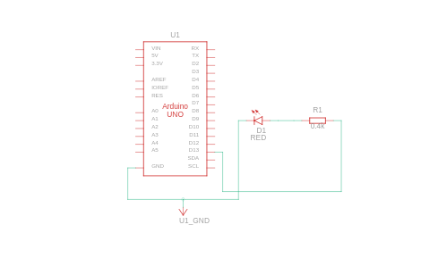

# 🔴 Arduino LED Blink

This project demonstrates the basic use of Arduino by blinking an LED using digital pin 13. It helps beginners get familiar with hardware setup, Arduino IDE, and simple coding.

---

## 🎯 Objective

To blink an LED at 1-second intervals using the Arduino Uno board.

---

## 🔧 Components Used

| Component      | Quantity |
|----------------|----------|
| Arduino Uno    | 1        |
| LED            | 1        |
| 0.4Ω Resistor  | 1        |
| Breadboard     | 1        |
| Jumper Wires   | 2-3      |

---

## 💡 Circuit Diagram

  
*LED is connected to pin 13 via a resistor.*


---

## 🧠 Code Explanation
```cpp

int led=13;
void setup()
{
  pinMode(led, OUTPUT);
}

void loop()
{
  digitalWrite(led, HIGH);
  delay(500); 
  digitalWrite(led, LOW);
  delay(500);
} 
 
``` 
## 🧠 Learning Outcomes

- Learned how to use `digitalWrite()` and `delay()` functions in Arduino
- Understood basic circuit setup with an LED and resistor
- Practiced using pinMode and loop structure
- Gained confidence in Tinkercad circuit design

---

## 📊 Project Status

✅ Completed — Basic LED Blink is working perfectly on both hardware and simulator  
🚀 Next Goal — Add button control or use PWM to fade LED
